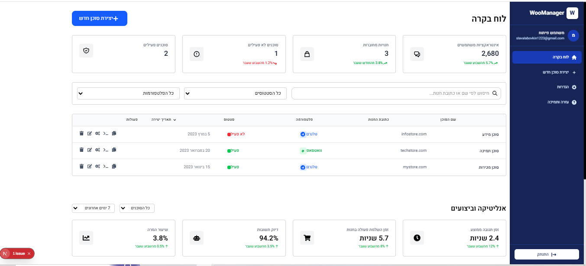

# WooManager - פלטפורמה לניהול סוכני AI לחנויות WooCommerce

WooManager הינה פלטפורמה מתקדמת המאפשרת למנהלי חנויות WooCommerce ליצור, לנהל ולעקוב אחר סוכני AI חכמים המתקשרים עם לקוחות דרך טלגרם וואטסאפ.

## צילומי מסך

### דשבורד ניהול הסוכנים


## תכונות מרכזיות

- **ניהול סוכני AI** - יצירה, עריכה, הפעלה והשבתה של סוכני AI חכמים
- **תמיכה בפלטפורמות מובילות** - אינטגרציה מלאה עם טלגרם וואטסאפ
- **אינטגרציה עם WooCommerce** - חיבור ישיר לחנויות מקוונות
- **ממשק בעברית** - מותאם במלואו לקהל יעד דובר עברית
- **סטטיסטיקות מתקדמות** - ניתוח ביצועים והתנהגות משתמשים
- **בסיסי ידע** - יכולת לחבר בסיסי ידע לסוכנים
- **אבטחה מתקדמת** - מערכת אימות והרשאות מלאה

## טכנולוגיות

הפרויקט בנוי כאפליקציית Next.js (גרסה 15.2.2) עם React (גרסה 19.0.0), המשתמשת ב:

- **Frontend:**
  - Next.js 15+
  - React 19+
  - Tailwind CSS
  - Framer Motion (אנימציות)
  - React Query (ניהול מצב)
  - Axios (תקשורת API)
  - React Hook Form & Zod (טיפול בטפסים וולידציה)
  - Chart.js & Recharts (תרשימים)

- **Backend:**
  - Node.js
  - API לניהול סוכנים ומשתמשים
  - אינטגרציה עם WooCommerce
  - חיבור למודלים של AI (GPT-4)

## מבנה הפרויקט

### Frontend (התיקייה הנוכחית)
- **app/** - דפי האפליקציה (App Router של Next.js)
  - **dashboard/** - דף הדשבורד הראשי
  - **create-agent/** - דף יצירת סוכן
  - **edit-agent/** - דף עריכת סוכן
  - **agent/** - דף פרטי סוכן
  - **login/** - דף התחברות
  - **settings/** - דף הגדרות
  - **help/** - דף עזרה

- **components/** - קומפוננטות משותפות
  - **ui/** - רכיבי UI בסיסיים (לחצנים, שדות קלט, כרטיסים וכו')
  - **agent/** - רכיבים ייעודיים לסוכנים

- **context/** - קונטקסט של React לניהול מצב גלובלי
  - **AuthContext.js** - ניהול אימות משתמשים
  - **AgentContext.js** - ניהול נתוני סוכנים

- **utils/** - פונקציות שירות ועזר
  - **api.js** - פונקציות לתקשורת עם ה-API
  - **index.js** - פונקציות עזר כלליות
  - **logger.js** - מערכת לוגים

### Backend (src/)
- API לניהול הסוכנים והמשתמשים
- תקשורת עם פלטפורמת WooCommerce
- אינטגרציה עם מודלים של AI

## התקנה והתחלה

### דרישות מקדימות
- Node.js 18+
- npm או yarn

### התקנה

```bash
# התקנת תלויות הפרויקט
npm install
# או
yarn install
```

### הרצת סביבת פיתוח

```bash
# הפעלת שרת הפיתוח
npm run dev
# או
yarn dev
```

גש ל-[http://localhost:3000](http://localhost:3000) בדפדפן כדי לראות את האפליקציה.

## מבנה API (בפיתוח)

המערכת מכילה API לניהול סוכנים, משתמשים ואינטראקציות:

- **API אימות:**
  - `POST /api/auth/login` - התחברות למערכת
  - `POST /api/auth/logout` - יציאה מהמערכת
  - `GET /api/users/me` - קבלת פרטי המשתמש המחובר

- **API סוכנים:**
  - `GET /api/agents` - קבלת רשימת הסוכנים
  - `GET /api/agents/:id` - קבלת פרטי סוכן ספציפי
  - `POST /api/agents` - יצירת סוכן חדש
  - `PUT /api/agents/:id` - עדכון פרטי סוכן
  - `DELETE /api/agents/:id` - מחיקת סוכן

- **API אנליטיקה:**
  - `GET /api/agents/:id/stats` - קבלת סטטיסטיקות של סוכן
  - `GET /api/agents/:id/logs` - קבלת לוגים של סוכן
  - `GET /api/agents/:id/conversations` - קבלת שיחות של סוכן

## פריסה

פריסת האפליקציה מומלצת על:

- **Vercel** - לחלק ה-Frontend
- **מערכות מארחות Node.js** - לחלק ה-Backend

## מצב פיתוח

הפרויקט כרגע נמצא בשלב פיתוח, עם תמיכה במצב פיתוח מקומי. הנתונים בסביבת העבודה הם בעיקרם נתונים מדומים (mock data), המאפשרים פיתוח ובדיקות ללא צורך בשרת API אמיתי.

---

# WooManager - AI Agents Management Platform for WooCommerce Stores (English)

WooManager is an advanced platform that enables WooCommerce store managers to create, manage, and track intelligent AI agents that communicate with customers via Telegram and WhatsApp.

## Key Features

- **AI Agent Management** - Create, edit, activate, and deactivate intelligent AI agents
- **Support for Leading Platforms** - Full integration with Telegram and WhatsApp
- **WooCommerce Integration** - Direct connection to online stores
- **Hebrew Interface** - Fully adapted for Hebrew-speaking audience
- **Advanced Statistics** - Performance analysis and user behavior tracking
- **Knowledge Bases** - Ability to connect knowledge bases to agents
- **Advanced Security** - Complete authentication and authorization system

## Technologies

The project is built as a Next.js application (version 15.2.2) with React (version 19.0.0), using:

- **Frontend:**
  - Next.js 15+
  - React 19+
  - Tailwind CSS
  - Framer Motion (animations)
  - React Query (state management)
  - Axios (API communication)
  - React Hook Form & Zod (form handling and validation)
  - Chart.js & Recharts (charts)

- **Backend:**
  - Node.js
  - API for managing agents and users
  - WooCommerce integration
  - Connection to AI models (GPT-4)

## Project Structure

### Frontend (current directory)
- **app/** - Application pages (Next.js App Router)
  - **dashboard/** - Main dashboard page
  - **create-agent/** - Agent creation page
  - **edit-agent/** - Agent editing page
  - **agent/** - Agent details page
  - **login/** - Login page
  - **settings/** - Settings page
  - **help/** - Help page

- **components/** - Shared components
  - **ui/** - Basic UI components (buttons, input fields, cards, etc.)
  - **agent/** - Agent-specific components

- **context/** - React context for global state management
  - **AuthContext.js** - User authentication management
  - **AgentContext.js** - Agent data management

- **utils/** - Service and helper functions
  - **api.js** - Functions for API communication
  - **index.js** - General helper functions
  - **logger.js** - Logging system

### Backend (src/)
- API for managing agents and users
- Communication with WooCommerce platform
- Integration with AI models

## Installation and Getting Started

### Prerequisites
- Node.js 18+
- npm or yarn

### Installation

```bash
# Install project dependencies
npm install
# or
yarn install
```

### Running Development Environment

```bash
# Start the development server
npm run dev
# or
yarn dev
```

Go to [http://localhost:3000](http://localhost:3000) in your browser to see the application.

## API Structure (In Development)

The system contains APIs for managing agents, users, and interactions:

- **Authentication API:**
  - `POST /api/auth/login` - Login to the system
  - `POST /api/auth/logout` - Logout from the system
  - `GET /api/users/me` - Get current user details

- **Agents API:**
  - `GET /api/agents` - Get list of agents
  - `GET /api/agents/:id` - Get specific agent details
  - `POST /api/agents` - Create a new agent
  - `PUT /api/agents/:id` - Update agent details
  - `DELETE /api/agents/:id` - Delete an agent

- **Analytics API:**
  - `GET /api/agents/:id/stats` - Get agent statistics
  - `GET /api/agents/:id/logs` - Get agent logs
  - `GET /api/agents/:id/conversations` - Get agent conversations

## Deployment

Recommended deployment platforms:

- **Vercel** - For the Frontend part
- **Node.js hosting services** - For the Backend part

## Development Status

The project is currently in development stage, with support for local development mode. The data in the working environment is mostly mock data, allowing development and testing without the need for a real API server.